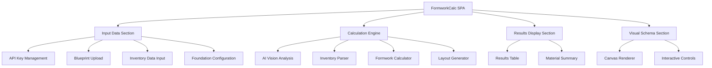
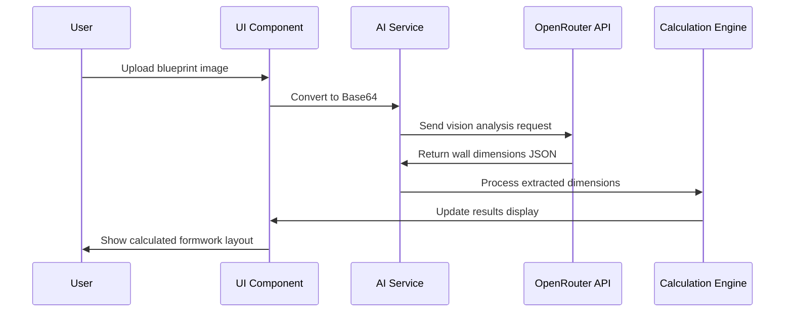
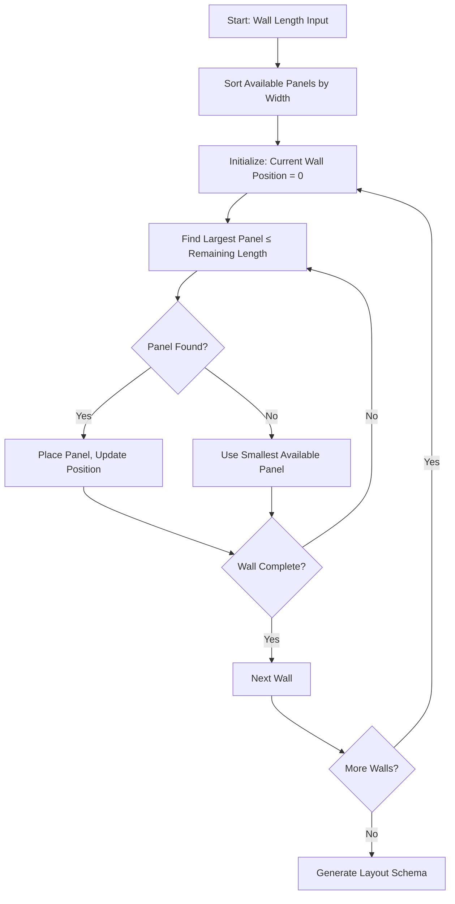
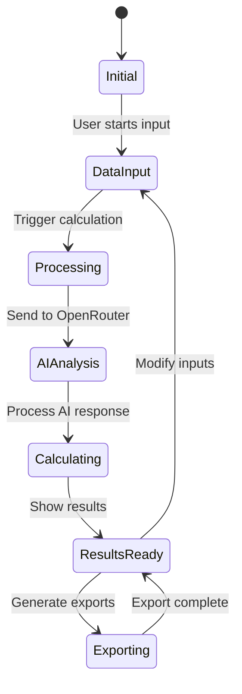

# FormworkCalc AI-Integrated Web Application Design

## Overview

FormworkCalc is a single-page web application (SPA) designed for engineers, foremen, and construction workers to automatically analyze foundation plans using AI, calculate required small-panel formwork quantities, and provide visual layout schemes. The application integrates with OpenRouter API for intelligent blueprint analysis and operates as a mobile-first, responsive tool deployable as a single HTML file.

### Primary Value Proposition
- **AI-Powered Analysis**: Automated extraction of wall dimensions from construction blueprints
- **Intelligent Formwork Calculation**: Optimized panel layout using greedy algorithm
- **Visual Schema Generation**: Interactive canvas-based layout visualization
- **Mobile-First Design**: Optimized for field use on tablets and smartphones
- **Zero-Deployment Complexity**: Single HTML file with embedded assets

### Target Users
- Construction Engineers
- Site Foremen
- Construction Workers
- Project Managers

## Technology Stack & Dependencies

### Core Technologies
| Technology | Purpose | Implementation |
|------------|---------|----------------|
| HTML5 | Application structure | Single-file architecture |
| CSS3 | Styling and responsive design | Tailwind CSS via CDN |
| JavaScript ES6+ | Application logic and AI integration | Native JavaScript only |
| Canvas API | Visual schema rendering | Browser-native drawing |
| File API | Blueprint image processing | Browser-native file handling |
| LocalStorage API | API key persistence | Browser-native storage |

### External Dependencies
| Service | Purpose | Integration Method |
|---------|---------|-------------------|
| Tailwind CSS | UI styling framework | CDN inclusion |
| OpenRouter API | AI vision analysis | REST API calls |
| Google Sheets | Formwork inventory data | CSV parsing via public URLs |

### Architecture Constraints
- **No Framework Dependencies**: Pure vanilla JavaScript implementation
- **Single File Structure**: All code contained in index.html
- **CDN-Only External Resources**: No local dependencies
- **Progressive Enhancement**: Core functionality without JavaScript fallbacks

## Component Architecture

### Application Structure



### Component Hierarchy

#### 1. Input Data Components
- **API Key Manager**: Secure storage and validation of OpenRouter credentials
- **Blueprint Uploader**: File input with image preview and validation
- **Inventory Connector**: Google Sheets integration for formwork panel data
- **Foundation Configurator**: Type selection and dimension input

#### 2. Processing Engine Components
- **AI Vision Service**: OpenRouter API integration for blueprint analysis
- **Data Parser**: CSV processing for inventory management
- **Calculation Engine**: Greedy algorithm implementation for panel optimization
- **Layout Generator**: Geometric calculations for visual schema

#### 3. Output Components
- **Results Table**: Dynamic data presentation with sorting capabilities
- **Visual Schema**: Interactive canvas with pan/zoom functionality
- **Export Controller**: PDF generation and data export capabilities

## AI Integration Architecture

### Vision Analysis Workflow



### API Integration Specifications

#### OpenRouter API Configuration
| Parameter | Value | Purpose |
|-----------|-------|---------|
| Endpoint | `https://openrouter.ai/api/v1/chat/completions` | Vision model access |
| Method | POST | Request submission |
| Authentication | Bearer token | API key validation |
| Content-Type | application/json | Request format |
| Response Format | JSON object | Structured data return |

#### Vision Model Selection Strategy
| Model | Use Case | Fallback Order |
|-------|----------|----------------|
| anthropic/claude-3-haiku | Primary vision analysis | 1st choice |
| google/gemini-pro-vision | Backup vision model | 2nd choice |
| openai/gpt-4-vision-preview | Secondary backup | 3rd choice |

### AI Prompt Engineering

#### Blueprint Analysis Prompt Structure
The AI prompt must achieve precise extraction of wall dimensions while avoiding hallucination:

**Prompt Components**:
1. **Role Definition**: Expert construction engineer identity
2. **Task Specification**: Dimension extraction from blueprints
3. **Output Format**: Strict JSON schema enforcement
4. **Validation Rules**: Only extract explicitly marked dimensions
5. **Error Handling**: Fallback for unclear or missing data

**Expected Response Schema**:
```json
{
  "walls": [
    {"length": 12000},
    {"length": 8500},
    {"length": 6000}
  ]
}
```

## Data Models & Processing Logic

### Foundation Data Model
| Field | Type | Validation Rules | Purpose |
|-------|------|------------------|---------|
| blueprintImage | File | PNG/JPEG, max 10MB | AI analysis input |
| foundationType | Enum | "strip" \| "slab" | Calculation method selection |
| foundationDepth | Number | 100-5000mm | Formwork height calculation |
| apiKey | String | OpenRouter format | API authentication |
| inventoryUrl | URL | Google Sheets public link | Panel data source |

### Inventory Data Model
| Column | Data Type | Constraints | Purpose |
|--------|-----------|-------------|---------|
| Width | Number | 50-3000mm | Panel width dimension |
| Height | Number | 100-3000mm | Panel height dimension |
| Quantity | Integer | 0-9999 | Available panel count |

### Calculation Results Model
| Field | Type | Description |
|-------|------|-------------|
| wallSegments | Array | Individual wall calculations |
| totalPanelsUsed | Number | Sum of all panels required |
| unusedPanels | Array | Remaining inventory |
| layoutSchema | Object | Visual representation data |
| materialCost | Number | Optional cost calculation |

## Business Logic Layer

### AI Vision Analysis Service

#### Image Processing Workflow
1. **Pre-processing**: Image validation and format standardization
2. **Base64 Conversion**: Prepare for API transmission
3. **API Request Construction**: Build OpenRouter-compatible payload
4. **Response Validation**: Parse and validate JSON response
5. **Error Handling**: Manage API failures and retry logic

#### Dimension Extraction Logic
- **Scale Detection**: Identify drawing scale markers
- **Unit Conversion**: Standardize to millimeters
- **Wall Identification**: Distinguish external from internal walls
- **Measurement Validation**: Cross-reference dimensions for consistency

### Formwork Calculation Engine

#### Greedy Algorithm Implementation


#### Optimization Strategy
- **Panel Selection Priority**: Maximize larger panels first
- **Waste Minimization**: Calculate optimal cutting patterns
- **Inventory Tracking**: Real-time availability updates
- **Layout Validation**: Ensure structural integrity requirements

### Inventory Management Service

#### Google Sheets Integration
1. **URL Validation**: Verify public access and CSV export capability
2. **Data Fetching**: HTTP GET request to CSV endpoint
3. **CSV Parsing**: Convert to structured JavaScript objects
4. **Data Validation**: Ensure required columns and data types
5. **Error Recovery**: Handle network failures and malformed data

## Visual Schema Generation

### Canvas Rendering Architecture

#### Drawing Coordinate System
- **Origin**: Top-left corner (0,0)
- **Scale Calculation**: Dynamic scaling based on foundation dimensions
- **Aspect Ratio**: Maintain proportional representation
- **Viewport Management**: Pan and zoom functionality

#### Layout Visualization Elements
| Element | Visual Representation | Interactive Features |
|---------|----------------------|---------------------|
| Foundation Outline | Black border lines | Hover tooltips with dimensions |
| Panel Placement | Colored rectangles | Click for panel details |
| Dimensions | Text annotations | Editable on double-click |
| Scale Reference | Grid overlay | Toggle visibility |

### User Interaction Features
- **Pan Functionality**: Drag to move viewport
- **Zoom Controls**: Mouse wheel and touch gestures
- **Panel Selection**: Click highlighting with details panel
- **Export Options**: PNG download and print optimization

## State Management

### Application State Structure


### Data Flow Management
- **Single Source of Truth**: Centralized application state object
- **Event-Driven Updates**: DOM manipulation through event listeners
- **Async Operations**: Promise-based API calls with loading states
- **Error Boundaries**: Graceful degradation on failures

## Testing Strategy

### Validation Approach
| Test Category | Validation Method | Success Criteria |
|---------------|------------------|------------------|
| AI Integration | Mock API responses | Correct dimension extraction |
| Calculation Logic | Unit test scenarios | Accurate panel optimization |
| UI Responsiveness | Device simulation | Mobile-first compatibility |
| File Processing | Various image formats | Robust file handling |
| Error Handling | Simulated failures | Graceful error recovery |

### Quality Assurance
- **Cross-Browser Testing**: Chrome, Firefox, Safari, Edge compatibility
- **Performance Validation**: Loading time under 3 seconds
- **Accessibility Compliance**: WCAG 2.1 AA standards
- **Security Review**: API key protection and XSS prevention